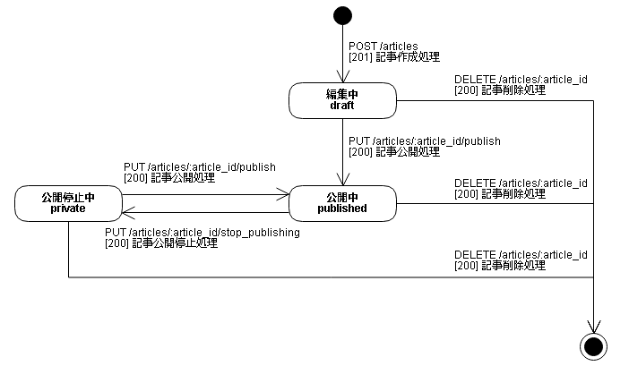

## 状態遷移設計

### 記事の状態

#### 状態遷移表
httpリクエスト | 開始状態 | 編集中 | 公開中 | 公開停止中 | 終了状態
-- | -- | -- | -- | -- | --
POST /articles | [201] 記事作成処理 / 編集中 | cannot happen 発生しえない | cannot happen 発生しえない | cannot happen 発生しえない | [201] 記事作成処理 / 編集中
PUT /articles/:article_id/publish | [404] / cannot happen | [200] 記事公開処理 / 公開中 | [204] 何もしない | [200] 記事公開処理 / 公開中 | [404] / cannot happen
PUT /articles/:article_id/stop_publishing | [404] / cannot happen | [204] 何もしない | [200] 記事公開停止処理 / 公開停止中 | [204] 何もしない | [404] / cannot happen
DELETE /articles/:article_id | [404] / cannot happen | [200] 記事削除処理 / 終了状態 | [200] 記事削除処理 / 終了状態 | [200] 記事削除処理 / 終了状態 | [404] / cannot happen

#### 状態遷移図

