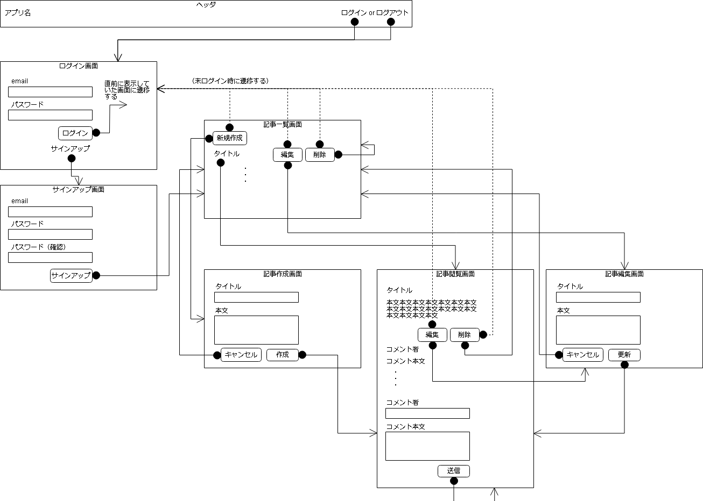

# 画面仕様

## 画面遷移図

## 認証に関する画面
### ログイン画面
* メールアドレスとパスワードを入力し、ログインを行うことができる
* ログイン後は、ログイン画面の直前に閲覧していた画面に遷移する
  * 直前の画面がなければ記事一覧画面に遷移する

### サインアップ画面
* メールアドレスとパスワードを入力し、サインアップを行うことができる
* サインアップ後は、ログイン状態で記事一覧画面に遷移する

## 記事に関する画面
### 記事一覧画面
* 記事のタイトルを、作成日時の降順で表示する
* タイトルをクリックすることで、記事を閲覧することができる
* 記事タイトルの横にある編集/削除ボタンから、記事の編集/削除ができる
* 新規作成ボタンをクリックすることで、記事作成画面に遷移する

### 記事閲覧画面
* 記事の内容を表示する
* 記事の下にある編集/削除ボタンから、記事の編集/削除ができる
* 記事本文の下に、コメントを降順で表示する
* [コメント入力コンポーネント](#コメント入力コンポーネント)より、記事に対するコメントを行うことができる

### 記事作成画面
* 記事のタイトルと本文を入力し、記事を新規投稿できる

### 記事編集画面
* 記事のタイトルと本文を編集することができる

## コンポーネント
### ヘッダーコンポーネント
* ログイン、サインアップ画面以外の、各画面上部に表示される
  * アプリ名をクリックすると、記事一覧画面に遷移する
  * ログイン/ログアウトを行うためのリンクがある

### コメント入力コンポーネント
* コメント者とコメント本文を入力して送信することにより、記事に対するコメントを行うことができる
